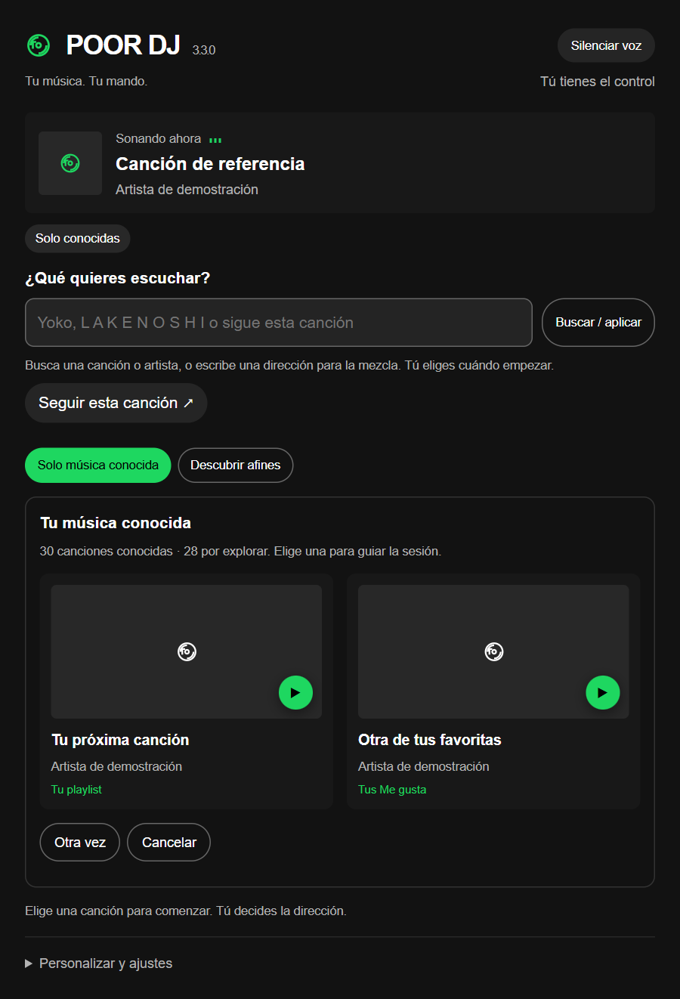
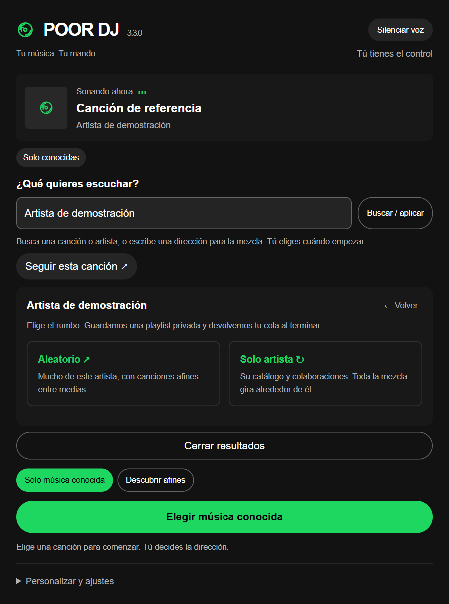

# POOR DJ

**3.3.0 · MIT · local · sin dependencias adicionales**

**Tu música. Tu mando.** Un DJ local para Spotify con Spicetify. Sigue lo que escuchas, busca canciones y artistas, y propone una mezcla que puedes dirigir por texto.



Vista de la interfaz actual con datos de demostración. No es una captura de una cuenta de Spotify.

- **Conocidas:** tarjetas de tus playlists, Me gusta y escuchas registradas, con su procedencia.
- **Artistas:** Aleatorio combina mucho de ese artista con música afín; Artista usa únicamente su catálogo y colaboraciones. Guarda una playlist privada.
- **Tú decides:** tu elección manual pausa el DJ; terminar devuelve la cola suspendida. Puedes descartar propuestas y cambiar la dirección.
- **Voz local y subtítulos:** comentarios breves en español. La música espera mientras habla; si el cliente no ofrece voz, continúa normalmente.
- **A tu gusto:** acentos, panel compacto y continuidad musical con transiciones nativas de Spotify.

## Qué puedes hacer

### Elegir cómo empieza la sesión

Pulsa **Solo música conocida** para elegir entre dos canciones y ver de dónde vienen. **Otra vez** muestra otras opciones; al agotar la selección puedes reiniciarla. Abrir el panel o explorar las tarjetas no inicia música. **Seguir esta canción** comienza desde lo que está sonando y mantiene esa referencia durante la sesión.

**Descubrir afines** permite ampliar la selección con candidatos relacionados con la referencia. El DJ considera afinidad, variedad de artistas, repetición reciente y, cuando están disponibles, datos de tempo, tonalidad y sonoridad. Si no hay candidatos compatibles, lo indica en lugar de completar la cola con canciones ajenas.

### Buscar canciones y mezclar artistas

Escribe un título o un artista en **¿Qué quieres escuchar?**. Cuando hay varias coincidencias, elige un resultado antes de cambiar la reproducción. Los resultados de artista abren dos opciones:

| Modo | Qué incluye |
| --- | --- |
| **Aleatorio** | El artista como protagonista, acompañado de canciones afines. |
| **Artista** | Solo canciones acreditadas al artista, incluidas colaboraciones. |

La mezcla se guarda como **playlist privada** y puedes abrir la última playlist guardada desde el panel.



### Dirigir el DJ con instrucciones

Las órdenes se interpretan mediante reglas locales. Puedes combinar preferencias y revisar las etiquetas de instrucciones vigentes en el panel.

| Ejemplo | Resultado |
| --- | --- |
| `solo conocidas y más variedad` | Limita la selección a música conocida y aumenta la variedad de artistas. |
| `solo conocidas y sin Dillom` | Excluye ese artista de la selección de la sesión. |
| `sigue esta canción` | Inicia desde la canción actual. |
| `pon SIN UN PLAN (TEGOCALDERON) de Isma` | Busca la canción para reproducirla; una elección manual pausa el DJ. |
| `otra sugerencia` | Renueva las sugerencias. |
| `termina el DJ` | Termina la sesión y devuelve la cola suspendida. |
| `restaura mi cola` | Solicita recuperar la cola guardada. |

Los filtros de género, como `reggaetón y más variedad`, necesitan etiquetas musicales declaradas. Puedes etiquetar la playlist actual y la canción desde **Etiquetas musicales**. Una orden incompleta o contradictoria muestra una explicación antes de aplicar cambios.

### Ajustar las propuestas sin perder tu cola

Usa **Más como esta**, **No encaja**, **Este artista no, por hoy** o **Demasiado repetida**; **Deshacer** revierte el último voto. En **A continuación** puedes pedir otra sugerencia y fijar una propuesta. La referencia y las exclusiones pertenecen a la sesión.

Una reproducción elegida manualmente pausa el DJ y retira sus propuestas. Suspender tu cola manual al iniciar es una opción desactivada por defecto. Al terminar, el DJ intenta devolver la cola suspendida; si la restauración queda incompleta, puedes volver a intentarlo. No modifica tus playlists existentes.

### Voz, transiciones y personalización

- **Voz local en español:** comentarios breves con subtítulos. La música espera mientras habla; puedes silenciar la voz. Si no hay una voz local compatible o reproduces en un dispositivo remoto, conserva los subtítulos.
- **Continuidad musical:** tres niveles y solapamiento nativo de Spotify de 0, 2, 4 o 6 segundos. Puedes aplicar el ajuste y restaurar el anterior. Este cambio también afecta a Spotify fuera del DJ; la extensión no hace fades de volumen propios ni adelanta el final de las canciones.
- **Presentación:** verde Spotify, colores del tema, azul, violeta o rosa; control compacto y panel compacto.
- **Preferencias:** entre una y tres canciones pendientes, contenido explícito y aprendizaje de la escucha configurables.

### Biblioteca y datos locales

**Mi biblioteca y fuentes** permite actualizar Me gusta y playlists, y seleccionar una playlist para leer hasta 300 canciones. La familiaridad distingue playlist, escucha registrada y votos; Spotify no proporciona aquí todo tu historial ni estadísticas completas.

En **Mis datos** puedes exportar e importar el perfil, guardar la sesión, borrar el aprendizaje o vaciar la caché acústica. El perfil y la lógica del DJ permanecen en el cliente. Las búsquedas y consultas musicales usan tu sesión de Spotify.

## Requisitos y límites

Necesitas Spotify de escritorio con Spicetify instalado. La versión 3.3.0 se comprobó en Windows con Spotify 1.3.3.264 y Spicetify 2.45.3; consulta [VALIDATION.md](VALIDATION.md) para el alcance de las pruebas. La disponibilidad de voz, datos acústicos y ajustes nativos depende del cliente. No mide lo «comercial» de una canción ni inventa géneros o BPM ausentes.

Sin cuentas extra, claves, hosting ni modelos de IA. Las órdenes usan reglas locales; las búsquedas y los datos musicales vienen de tu sesión de Spotify. No lee tus estadísticas completas ni garantiza género/BPM cuando faltan datos.

## Instalar

En Marketplace, busca **POOR DJ** cuando el repositorio público esté indexado. También puedes descargar el ZIP y su SHA-256 desde [Releases](https://github.com/gvayoy-web/poor-dj/releases).

Para instalar manualmente, copia `poor-mans-dj.js` a la carpeta `Extensions` de Spicetify y ejecuta:

```sh
spicetify config extensions poor-mans-dj.js
spicetify apply
```

Abre POOR DJ desde el reproductor. Busca un título o artista, elige una tarjeta, o pulsa **Seguir esta canción**. Ejemplos: `solo conocidas y más variedad`, `sigue esta canción`, `termina el DJ`. Las instrucciones incompletas se explican antes de aplicar cambios.

## Desarrollar

Node.js 24 o posterior. Sin dependencias de ejecución ni compilación:

```sh
node build.cjs
node --check poor-mans-dj.js
node --test --test-isolation=none test/*.test.cjs
node release.cjs
```

La prueba opcional de interfaz requiere Playwright y Microsoft Edge: `node test/ui.smoke.cjs`. Ver [validación](VALIDATION.md), [contribución](CONTRIBUTING.md), [código de conducta](CODE_OF_CONDUCT.md) y [publicación y releases](PUBLISHING.md).

MIT. Proyecto independiente, sin afiliación con Spotify o Spicetify.
